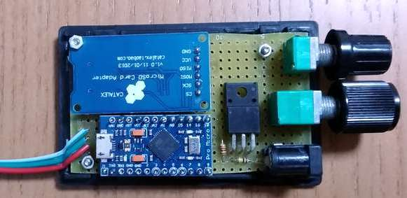
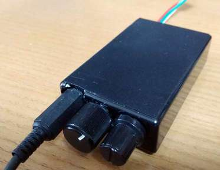
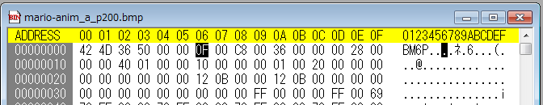

# ws2812b_leonardo
ws2812b_leonardo

     
     
    
    
SDカードに保存されたBMPファイルをLEDマトリクスに表示します。 
      SDカードの最大容量は32GBです。

電源ONでSDカードにアクセスし、ルートフォルダのファイルに順にアクセスします。 
      ファイルの属性をチェックし、ヘッダが32bitのBMPファイルだったならば、 
      幅と高さを確認して、OKだったらファイルに1バイトずつアクセスして、 
      R,G,Bを順に読み込み、明るさを調整して、LEDマトリクスの配列に格納します。 
       
      アニメーションを実現するには、LEDマトリクスの大きさ毎に画像を配列した 
      BMPファイルを作成します。

      
       
      BMPファイルのヘッダのReserve領域①(bfReserved1)に『LEDマトリクスの幅－１』 
      （LEDマトリクスの幅が16ならば15 = 0x0F）を入力します。 
      ビットマップファイルのヘッダはリトルエンディアンなので、0x0F,0x00です。

    
アニメーション表示、スクロールスピードはReserve領域②(bfReserved2)に値を入れて制御します。 
      その他の値と同様、リトルエンディアンで入力します。 
      追加のポーズ時間が200msなら、0xC8, 0x00 です。

    
    
 
      予約領域に入れた値は画像編集ソフトで保存すると0に上書きされてしまうので 
      要注意です。また、Windowsの『ペイント』は24bit Bitmapで保存するので 
      他のソフトで32bit（ARGB）で保存し直す必要があります。 
       
